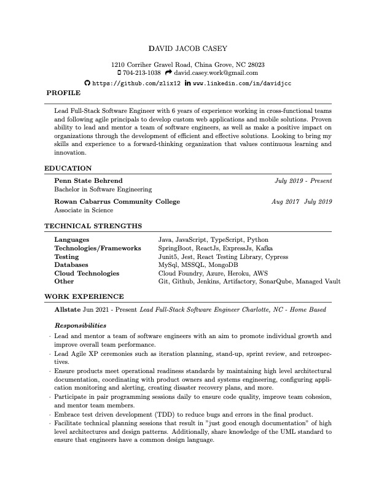
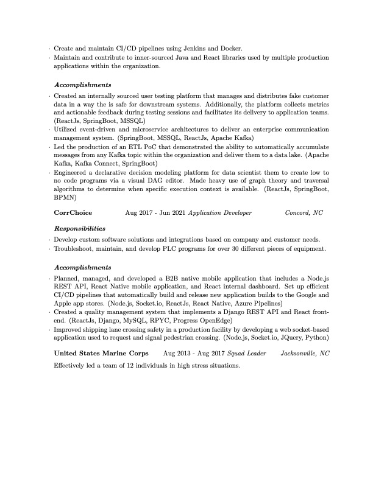

# Resume

I created this project as a cool way to maintain my resume and to avoid MS Word as much as possible. The concept of
generating a resume from LaTeX was taken from one of my coworkers and the implementation was refined by looking at the
work of many others that have taken a similar approach.

## Generating

```shell
docker build -t djc/latex .
```

```shell
docker run --rm -i -v "$PWD":/data djc/latex pdflatex -output-directory=./out resume.tex 
```

## Preview


